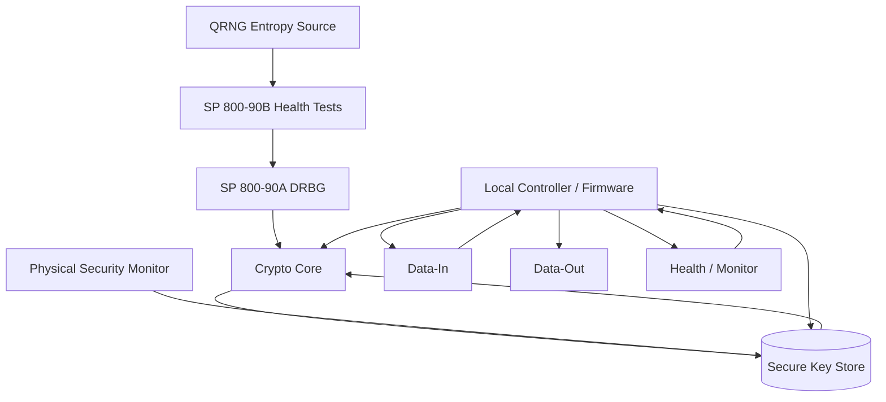
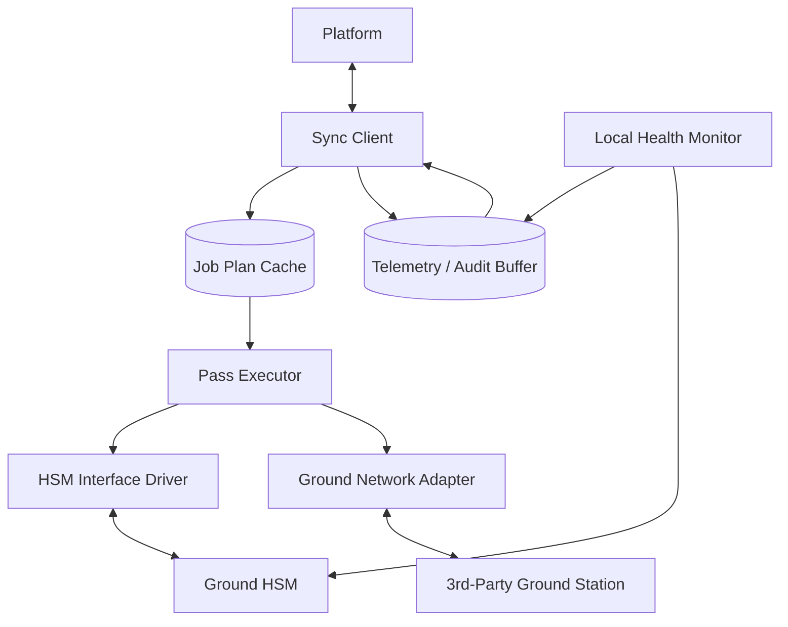
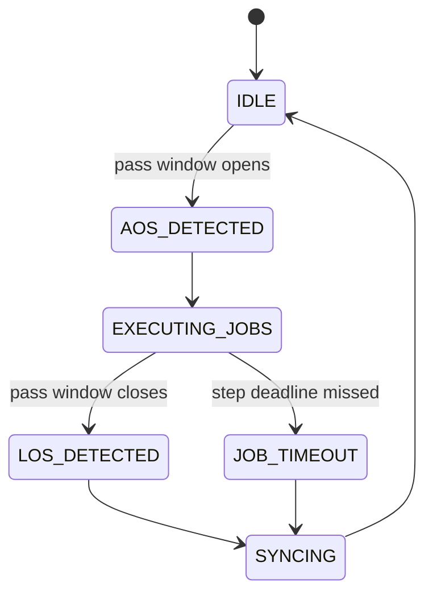
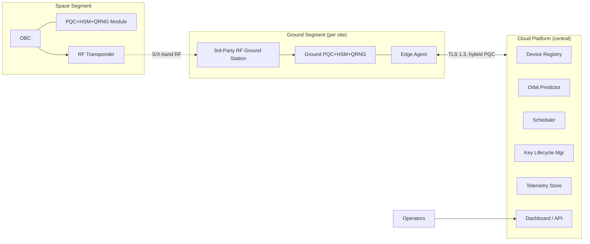
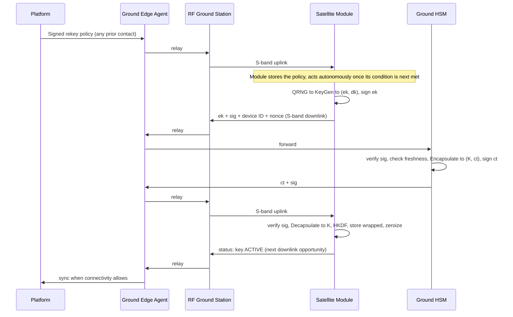
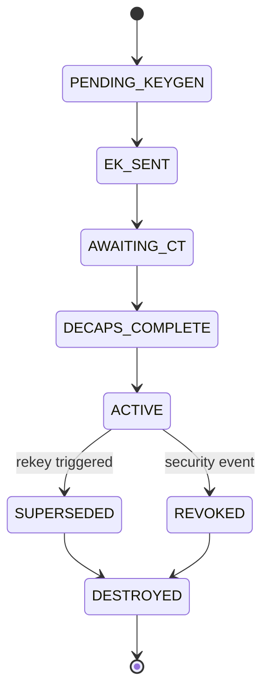
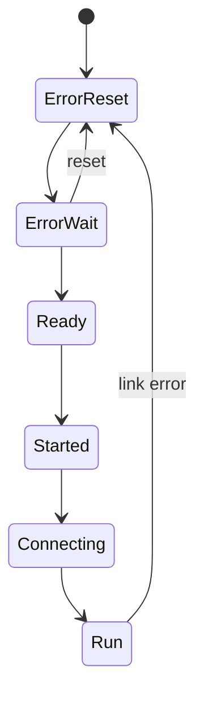
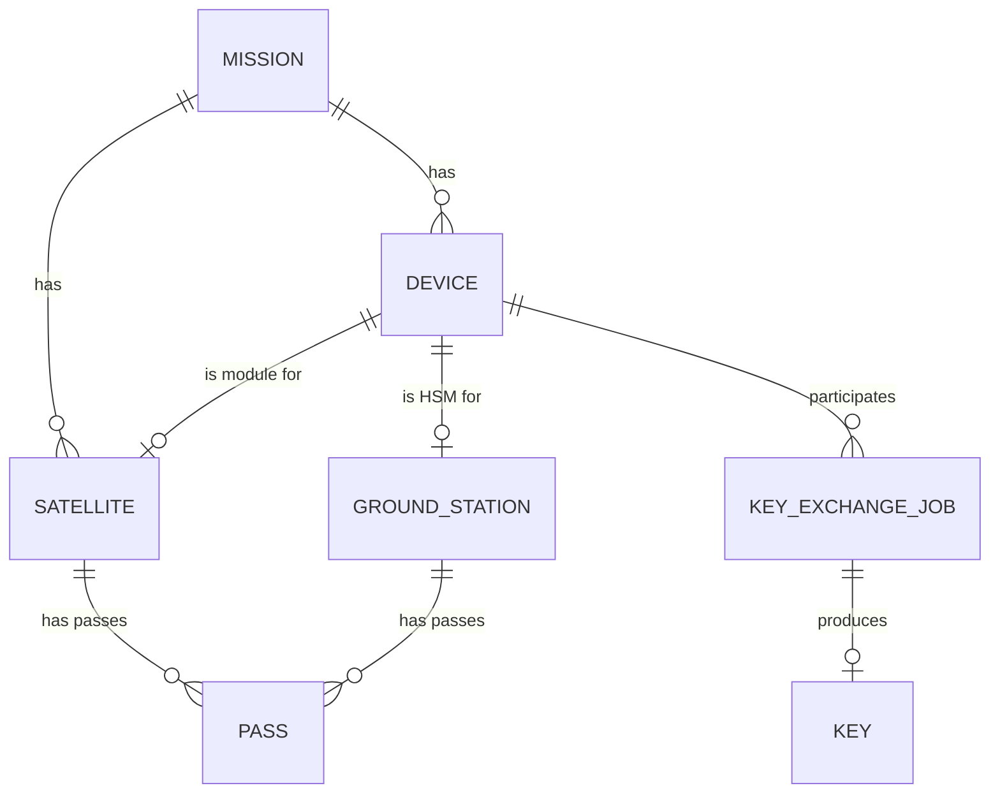

# Origo System Design

**Scope:** Hardware (satellite + ground PQC/HSM/QRNG modules) and software (fleet orchestration platform) for a post-quantum-secure satellite command/telemetry link using ML-KEM (FIPS 203) key establishment and hardware-backed key custody.

**Document map:** §1 actors & trust boundaries · §2 space segment · §3 ground segment · §4 cloud platform · §5 ML-KEM protocol · §6 data plane · §7 SpaceWire deep-dive · §8 data model/API · §9 security hardening · §10 deployment view · §11 open questions

---

## 0. Design Principle & Working Assumptions

**Core principle:** Cryptographic custody and real-time execution live inside the HSM trust boundary - the satellite Module and the Ground HSM. Orchestration, scheduling, fleet visibility, and policy live in the Platform. The Platform must be designed so that a full compromise of it yields operational visibility and disruption capability at worst - **never** plaintext key material, and never the ability to forge a valid session. This mirrors how banking HSM infrastructure separates the payment switch (orchestration) from the HSM (custody); the same discipline applies to a satellite fleet.

Assumptions made explicit (stated where the brief was open to more than one reading):

- **Interface directionality:** "Data-In" = OBC → Module, "Data-Out" = Module → OBC. Both interfaces carry a _mix_ of key-exchange and bulk-data traffic, categorized by direction, not by data type.
- **Health/Monitor** is treated as a distinct, lower-rate, higher-_availability_ control-plane channel - deliberately isolated so it stays up even if the bulk data path is saturated or erroring.
- **Ground topology:** the RF ground station (antenna + modem) is a third-party, untrusted bent-pipe relay, architecturally separate from the Ground PQC+HSM device, which is the product.
- **Mission class:** primary target is a LEO smallsat, the dominant NewSpace pattern; the design generalizes upward to larger buses.
- **Bus technology:** SpaceWire is treated as the primary satellite-internal interconnect per the brief, with an explicit fallback path to lower-cost buses (CAN / RS-422 / UART / I2C) for cost-sensitive cubesat-class missions, since SpaceWire's rad-hard silicon cost isn't always justified below a certain mission class.

---

## 1. Actors, Segments, and Trust Boundaries

| Component                   | Segment | Trust boundary                    | Sees plaintext key material? | Primary role                                                                                        |
| --------------------------- | ------- | --------------------------------- | ---------------------------- | --------------------------------------------------------------------------------------------------- |
| OBC                         | Space   | Outside HSM                       | No                           | Flight computer; routes bytes between Module, transponder, and payload - never touches key material |
| PQC+HSM+QRNG Module         | Space   | **HSM boundary**                  | Yes - its own keys only      | KeyGen, Decaps, AEAD encrypt/decrypt, entropy, key custody                                          |
| RF Transponder              | Space   | Outside                           | No                           | Modulates/demodulates S-band and X-band; moves opaque bytes                                         |
| 3rd-party RF Ground Station | Ground  | Outside - untrusted relay         | No                           | Bent-pipe RF↔terrestrial; never trusted with secrets by design                                      |
| Ground PQC+HSM+QRNG         | Ground  | **HSM boundary**                  | Yes - its own keys only      | Encaps, key custody, bulk crypto for the downlink                                                   |
| Ground Edge Agent           | Ground  | Outside HSM, trusted orchestrator | No                           | Real-time job execution during passes, local buffering, sync to Platform                            |
| Cloud Platform              | Cloud   | Outside HSM boundary, entirely    | No                           | Scheduling, registry, telemetry, policy, dashboards, audit                                          |

Everything below is a consequence of this table. If a feature request would ever require the Platform to hold or compute with a private key or a session key, that's a signal the feature belongs in HSM firmware instead, exposed to the Platform as a command/config - not as a data flow.

---

## 2. Space Segment

### 2.1 OBC to Module Interfaces

| Interface      | Direction     | Typical payloads                                                                                                                                         | Carrier (see §7)                      |
| -------------- | ------------- | -------------------------------------------------------------------------------------------------------------------------------------------------------- | ------------------------------------- |
| Data-In        | OBC → Module  | Plaintext telemetry to be encrypted; received ciphertext to be decrypted; received `ct` for decapsulation                                                | SpaceWire packet (CCSDS-encapsulated) |
| Data-Out       | Module → OBC  | Encrypted telemetry ready for downlink; decrypted commands; generated `ek` ready for downlink                                                            | SpaceWire packet (CCSDS-encapsulated) |
| Health/Monitor | Bidirectional | Tamper flags, temperature, entropy health, self-test results, key inventory, error counters (out); self-test triggers, resets, signed config pushes (in) | SpaceWire + RMAP (register model)     |

### 2.2 Module Internal Architecture



- **QRNG entropy source** - feeds a health-tested, conditioned DRBG. This is the randomness consumed by KeyGen (and, on the ground side, by Encaps - see §5.1).
- **Crypto core** - ML-KEM (key establishment), ML-DSA (signing/verification for authenticated handshakes), an AEAD cipher for bulk payload protection, HKDF for session-key derivation. Implemented with constant-time arithmetic; side-channel resistance matters here in a way it wouldn't for a purely software implementation.
- **Secure key store** - a one-time-programmable root key burned in at manufacture (never rewritable, anchors the device's identity), plus rewritable NVM for session keys, stored wrapped under a device-local key-encryption key, with an integrity check (not just encryption) on every read.
- **Physical security monitor** - The _threat model differs sharply between the two ends of this system_. The Ground HSM faces a conventional threat model: physical access, insider threat, data-center security - the same one every commercial HSM is built for. The satellite Module's dominant threats are different: pre-launch supply-chain tampering (during manufacture, integration, and test, when it _is_ physically accessible) and **radiation-induced single-event upsets (SEUs)** once on orbit, which can flip bits in key material or in-flight computation. The mitigation for the latter isn't tamper response - it's integrity-checked storage (so a flipped key byte is _detected and rejected_, not silently used) and error-detection/correction on the crypto core's working memory.
- **Local controller/firmware** - owns the interface protocol stacks, a local job queue (executes whatever the Platform last configured - e.g. "next contact, initiate key exchange"), local buffering of telemetry/audit events for the long stretches with no ground contact, and self-test scheduling (power-on self-test plus periodic continuous tests).

### 2.3 What Runs on the Module

| Function                                                           | On the Module? | Notes                                        |
| ------------------------------------------------------------------ | -------------- | -------------------------------------------- |
| QRNG generation + entropy health tests                             | **Yes**        |                                              |
| ML-KEM KeyGen                                                      | **Yes**        |                                              |
| ML-KEM Decapsulate                                                 | **Yes**        |                                              |
| AEAD encrypt/decrypt of payload                                    | **Yes**        |                                              |
| HKDF session-key derivation                                        | **Yes**        |                                              |
| Signing (`ek`, telemetry) / signature verification (`ct`, configs) | **Yes**        | §5.1                                         |
| Key storage, wrapping, zeroization                                 | **Yes**        |                                              |
| Power-on & continuous self-test                                    | **Yes**        |                                              |
| Local audit-event buffering                                        | **Yes**        | Drained to Platform when contact allows      |
| _Deciding_ rekey timing/policy                                     | **No**         | Platform decides; Module executes on command |
| _Deciding_ pass/contact schedule                                   | **No**         | Platform (orbit predictor + scheduler)       |
| Long-term telemetry storage & analytics                            | **No**         | Platform                                     |
| Fleet-wide device registry                                         | **No**         | Platform                                     |
| User/operator dashboards, RBAC                                     | **No**         | Platform                                     |

---

## 3. Ground Segment

### 3.1 Third-Party RF Ground Station

RF in, bytes out (or vice versa), over whatever terrestrial handoff the ground-network provider offers (commercial ground-station-as-a-service providers - e.g. AWS Ground Station, KSAT, Leaf Space, Atlas Space Operations - typically hand off demodulated frames over a socket/VPC interface). It never needs to be trusted, because the only things transiting it are already protected: `ek` and `ct` are public-by-design KEM artifacts (their confidentiality isn't the point - their _authenticity_ is, which is why §5.1 adds signatures), and bulk telemetry/data is already AEAD-encrypted before it ever reaches the transponder.

Because different ground networks expose different integration APIs, build a thin **Ground Network Adapter** abstraction in front of the Edge Agent (§3.3), so onboarding a new ground-station partner is a new adapter, not a platform rewrite.

### 3.2 Ground PQC+HSM+QRNG

Architecturally similar internals to the Module (§2.2), with two differences that follow directly from a different operating environment:

1. **No power/mass constraints** - mains-powered, so there's no reason to skimp on crypto-core performance or physical-security features.
2. **Conventional physical threat model** - data-center access control and insider threat, not SEUs or launch survival.

### 3.3 Ground Edge Agent
 
This component exists for one reason: **a LEO pass lasts minutes, and the Platform must never be in the hot path of one.** If every step of the key-exchange or data-delivery protocol required a live cloud round-trip, mission-critical timing would depend on internet latency and platform uptime during the one window with contact. Instead, the Platform pushes a **job plan** ahead of time; the Edge Agent executes it locally, live; and syncs status back up once the window closes.
 
#### 3.3.1 Internal Architecture
 

 
- **Sync Client** - the only component that talks to the Platform, and only when connectivity allows. Downloads the next batch of job plans and any pending config pushes; uploads buffered telemetry, audit events, and job-completion status. Authenticates to the Platform via mTLS using the Edge Agent's own device credential (distinct from, but provisioned alongside, the Ground HSM's identity).
- **Job Plan Cache** - durable local store of upcoming job plans (§3.3.2), each with a validity window. If the Platform is unreachable, the Edge Agent keeps operating off the last plan it received rather than stalling - a Platform outage should degrade scheduling flexibility, not strand a ground station mid-pass.
- **Pass Executor** - the component actually live during a contact window; runs the Pass Execution state machine (§3.3.3), sequencing calls to the HSM Interface Driver and the Ground Network Adapter according to the cached job plan, with no cloud dependency in this path.
- **HSM Interface Driver** - the local link to the Ground HSM. Recommend Ethernet/TCP with mutual TLS, authenticated using the Ground HSM's own ML-DSA-backed device identity - the same one it uses for the satellite-facing handshake (§5.1) - one root of trust rather than a second local-only credential.
- **Ground Network Adapter** - provider-specific integration (§3.1); the Pass Executor talks to it through a common internal interface (`submit_contact_request`, `get_contact_status`, `stream_frames`) regardless of which GSaaS provider is behind it.
- **Local Health Monitor** - watches both the Edge Agent's own liveness and the Ground HSM's reported health (temperature, tamper flags, self-test results), feeding the Telemetry/Audit Buffer independent of whether a pass is in progress.
#### 3.3.2 Job Plan Format
 
What the Platform actually pushes down - enough for the Pass Executor to run an entire pass without asking the cloud "what's next":
 
```
JobPlan {
  plan_id: UUID
  ground_station_id: UUID
  pass_id: UUID
  valid_from, valid_until: timestamp   // outside this window, don't execute - treat as stale
  steps: [
    {
      step_id: UUID
      job_id: UUID                     // references a KeyExchangeJob or data-delivery job
      job_type: enum [KEY_EXCHANGE, DATA_DELIVERY, CONFIG_DELIVERY]
      expected_start_offset_sec: int   // relative to AOS
      timeout_sec: int
    }
  ]
  signature: bytes                     // signed with the Platform's config-signing key (§8.3)
}
```
 
The signature matters here for the same reason config pushes are signed (§9): the Edge Agent should refuse to execute a job plan it can't verify came from the Platform, even though it isn't itself an HSM.
 
#### 3.3.3 Pass Execution State Machine
 

 
A step that misses its deadline doesn't retry mid-pass - it's marked `JOB_TIMEOUT` and left for the Job Orchestration Engine to reschedule on the next available pass, once the Edge Agent syncs back up. Better to cleanly fail one step than let a stuck retry consume the rest of a short window.
 
#### 3.3.4 Deployment & Security Posture
 
Physically, this is a small industrial-grade compute unit co-located with the Ground HSM at each ground-station site - not a cloud VM, since it needs a local, low-latency link to the HSM and the ground network's own equipment. Run its components as containers, matching the Platform's own containerization choice (§4.1), so the identical build deploys at any site regardless of which GSaaS provider's antenna sits behind it.
 
Security-wise, the Edge Agent sits outside the HSM boundary but isn't nothing: it handles job plans, ciphertext, and already-signed (non-secret) `ek`/`ct` artifacts, and it authenticates to the Platform with its own device credential. A compromised Edge Agent should degrade to *"attacker sees scheduling metadata and ciphertext, and can disrupt operations for that site"* - never *"attacker extracts key material."* That containment is exactly why the crypto operations stay in the Ground HSM and never in the Agent's own process.

### 3.4 What Runs at the Ground Edge vs. What's Deferred to Cloud

| Function                                         | Edge (Agent + HSM)? | Notes                                                      |
| ------------------------------------------------ | ------------------- | ---------------------------------------------------------- |
| ML-KEM Encapsulate                               | **Yes** (HSM)       |                                                            |
| AEAD decrypt of downlinked telemetry             | **Yes** (HSM)       |                                                            |
| Signature verification of `ek` / signing of `ct` | **Yes** (HSM)       |                                                            |
| Pass-time protocol sequencing                    | **Yes** (Agent)     | Executes a pre-fetched job plan without a cloud round-trip |
| Local job/telemetry buffering                    | **Yes** (Agent)     |                                                            |
| _Deciding_ the job plan / rekey policy           | **No**              | Platform, pushed down ahead of the pass                    |
| Cross-station scheduling / conflict resolution   | **No**              | Platform                                                   |
| Long-term storage, dashboards                    | **No**              | Platform                                                   |

---

## 4. Cloud Platform

### 4.1 Deployment Topology

Three tiers, matching §1-§3:



- **Central Cloud Platform**: a standard multi-tenant SaaS deployment (public cloud region) as the default. Because real-time execution is delegated to the Edge Agents, the Platform's control plane does not need to be latency-colocated with any ground station - it can be a single region with read replicas near the dashboard users.
- **On-prem / private-cloud variant**: government and defense customers in this sector very often require single-tenant, on-prem, or even air-gapped deployment rather than shared SaaS. Architect the Platform as containerized (e.g. Kubernetes-deployable) from day one so the _same_ codebase serves both the SaaS product and a customer-hosted deployment.
- **Data residency**: worth deciding early whether any target customer segment (government, defense-adjacent) will require in-country hosting of telemetry/metadata. This doesn't affect the HSM boundary (which never leaves the customer's physical control anyway) but does affect where the Platform's databases live.

### 4.2 Core Services

| Service                            | Responsibility                                                                                                                                                                                                                                                                      |
| ---------------------------------- | ----------------------------------------------------------------------------------------------------------------------------------------------------------------------------------------------------------------------------------------------------------------------------------- |
| **Device Registry & Identity**     | Binds a physical device (satellite Module or Ground HSM) to a platform-known identity: device ID + public verification key + certificate chain, established during a secure provisioning ceremony. Never holds a private key.                                                       |
| **Orbit Tracker & Pass Predictor** | Ingests TLEs (e.g. from Space-Track/Celestrak, or an operator's own ephemeris), propagates via SGP4/SDP4, computes AOS/LOS windows per satellite-ground-station pair for scheduling. Az/el/Doppler handoff to the ground network's own pointing system where the provider wants it. |
| **Scheduler / Conflict Resolver**  | Turns predicted passes + operator policy into concrete jobs: which key exchanges and data deliveries happen on which pass, resolving contention across multiple satellites/stations.                                                                                                |
| **Key Lifecycle Manager**          | Tracks key **metadata and state** - key ID, algorithm/parameter set, creation/expiry, associated device pair, lifecycle state (§5.5). Never the key bytes.                                                                                                                          |
| **Job Orchestration Engine**       | State machine per job (SCHEDULED → DISPATCHED → IN_PROGRESS → COMPLETED/FAILED/TIMED_OUT), with retry logic.                                                                                                                                                                        |
| **Telemetry Ingestion & Store**    | Time-series store for health telemetry from both segments; feeds dashboards and alerting.                                                                                                                                                                                           |
| **Config & Policy Manager**        | Builds and signs configuration pushed to devices (rekey policy, parameter-set choice, allowed cipher suites) - the receiving HSM verifies the signature before applying anything.                                                                                                   |
| **Audit & Compliance Log**         | Immutable, hash-chained record of every job, every config push, every anomaly.                                                                                                                                                                                                      |
| **Alerting / Notification**        | E.g. a tamper flag pages the security officer immediately, independent of the dashboard being open.                                                                                                                                                                                 |
| **IAM / RBAC**                     | Operator roles, with M-of-N (dual-control) approval for sensitive actions like manual key revocation - mirrors standard HSM governance practice.                                                                                                                                    |
| **Ground Network Adapter Layer**   | One adapter per third-party ground-station integration, isolating the rest of the Platform from provider-specific APIs.                                                                                                                                                             |
| **Dashboard / API Gateway**        | Operator-facing UI; REST/gRPC surface for everything above.                                                                                                                                                                                                                         |

### 4.3 What Runs on the Platform

| Function                                          | On the Platform? | Notes                                         |
| ------------------------------------------------- | ---------------- | --------------------------------------------- |
| Device identity registration (public keys, certs) | **Yes**          | Metadata only                                 |
| Orbit propagation, pass prediction                | **Yes**          |                                               |
| Job/pass/rekey scheduling & conflict resolution   | **Yes**          |                                               |
| Key lifecycle **state tracking**                  | **Yes**          | Metadata only                                 |
| Telemetry storage, dashboards, alerting           | **Yes**          |                                               |
| Signed config authoring                           | **Yes**          | Verified in hardware before it's ever applied |
| Audit logging                                     | **Yes**          |                                               |
| KeyGen / Encaps / Decaps / AEAD crypto            | **No**           | HSM boundary only                             |
| Holding or computing with any private/session key | **No**           | Never, under any circumstance                 |

---

## 5. ML-KEM Key Establishment Protocol

### 5.1 Closing the Authentication Gap

The described flow - satellite KeyGens, sends `ek` to ground, ground Encaps, sends `ct` back, satellite Decaps - is the right _shape_, but as stated it has a gap: **a bare KEM exchange provides no origin authentication.** ML-KEM only guarantees that whoever holds the matching `dk` can recover the shared secret from a given `ct` - it says nothing about whether the `ek` received actually came from the satellite. If anything upstream of the ground relay can substitute its own `ek`, it can run the entire exchange as a man-in-the-middle, and both endpoints will believe they've securely paired with each other.

The fix is to pair ML-KEM (confidentiality) with a signature scheme (authenticity) - **ML-DSA (FIPS 204)** is the natural choice, as NIST's companion PQC signature standard:

- At provisioning, each device gets a long-term ML-DSA identity keypair, with the verification key registered with the Platform's Device Registry (§4.2) and chained to a root the operator controls.
- The satellite signs `ek` (plus a nonce and device ID) before transmitting it; the Ground HSM verifies that signature - and checks freshness against the nonce - before trusting the `ek` enough to encapsulate against it.
- The Ground HSM signs `ct` before sending it back; the satellite verifies before decapsulating.

One efficiency note: ML-DSA signatures are meaningfully larger than classical ECDSA/Ed25519 (multiple KB vs. tens of bytes), so it's worth paying that cost only at the cold handshake. Once the shared secret exists, ordinary AEAD authentication tags (which are used for the bulk data plane) authenticate ongoing traffic for free - no need to sign every packet.

### 5.2 Full Protocol Flow

1. **Platform → Edge Agent** (via the terrestrial network, whenever there's next a contact opportunity - not necessarily the same pass as the exchange itself): a signed rekey policy.
2. **Edge Agent → Ground Network Adapter → RF Ground Station → S-band uplink → OBC → Module**: the policy is delivered and stored. The Module does **not** wait for a live "go" command from the Platform - there isn't one to wait for. It autonomously triggers step 3 the next time its stored policy's rekey condition is met during an active contact window - the same autonomy principle as the Edge Agent's own job-plan caching (§3.3.1), applied symmetrically on the space side.
3. **Module**: QRNG → health-tested/conditioned entropy → ML-KEM `KeyGen()` → (`ek`, `dk`). Signs `ek` (+ nonce, device ID) with its ML-DSA identity key.
4. **Module → OBC (Data-Out) → RF Transponder (S-band downlink) → RF Ground Station → Ground Network Adapter → Edge Agent → Ground HSM**: `ek` + signature + device ID + nonce. Every arrow in that chain is a real hop; the Platform is not, and cannot be, anywhere in it.
5. **Ground HSM**: verifies the signature against the satellite's registered verification key, checks nonce freshness (replay protection). If valid: `Encapsulate(ek)` → (`K`, `ct`). Signs `ct` with its own ML-DSA identity key.
6. **Ground HSM → Edge Agent → Ground Network Adapter → RF Ground Station → S-band uplink → OBC (Data-In) → Module**: `ct` + signature.
7. **Module**: verifies the Ground HSM's signature, `Decapsulate(dk, ct)` → `K`. Derives traffic keys via `HKDF(K, context)`. Stores the derived session key wrapped in secure NVM; zeroizes transient KEM state.
8. **Module → OBC → RF Transponder → RF Ground Station → Ground Network Adapter → Edge Agent** (status only, at the next downlink opportunity - possibly later in the same pass, possibly a subsequent one) and **Ground HSM → Edge Agent** (a local, not RF, hop): key ID, timestamp, health - never the key itself. **Edge Agent → Platform**: synced whenever connectivity allows, not necessarily in real time.
9. **Platform**: Key Lifecycle Manager transitions the key `PENDING → ACTIVE`, logs the audit event. Because there's no live channel to push the next rekey trigger either, it updates the *stored* policy if anything changed - ready for the Module to act on at its next autonomous trigger.



### 5.3 Key/Ciphertext Sizes & S-Band Bandwidth Budget

| Parameter set | `ek`    | `dk`    | Ciphertext | Shared secret | Security category     |
| ------------- | ------- | ------- | ---------- | ------------- | --------------------- |
| ML-KEM-512    | 800 B   | 1,632 B | 768 B      | 32 B          | Category 1 (~AES-128) |
| ML-KEM-768    | 1,184 B | 2,400 B | 1,088 B    | 32 B          | Category 3 (~AES-192) |
| ML-KEM-1024   | 1,568 B | 3,168 B | 1,568 B    | 32 B          | Category 5 (~AES-256) |

Even at ML-KEM-1024, the full handshake payload (public key or ciphertext, plus an ML-DSA signature, plus framing) is a few KB - negligible against any realistic S-band control-plane link budget, even a conservative one. Given satellites routinely operate for years, and "harvest now, decrypt later" is precisely the threat PQC migration exists to close, **default to ML-KEM-1024** unless a specific customer/mission has a reason to trade security margin for the (here, essentially irrelevant) bandwidth savings of a smaller parameter set. Keep it configurable per mission via Platform policy regardless.

### 5.4 Key Hierarchy

- **Device root/identity key** - provisioned once at manufacture, in an OTP store, never exported. Anchors device identity.
- **Long-term ML-DSA signing keys** - used to authenticate `ek`/`ct` exchanges and verify signed configs; rotated infrequently via a deliberate re-provisioning ceremony, not automatically.
- **Session/traffic keys** - derived per key-exchange event via ML-KEM + HKDF, used for actual AEAD bulk encryption; short-lived, rotated per §5.6 policy.

### 5.5 Key Lifecycle State Machine



### 5.6 Rekey Policy Options

| Policy       | Trigger                                                  | Tradeoff                                              |
| ------------ | -------------------------------------------------------- | ----------------------------------------------------- |
| Time-based   | Every N hours/days                                       | Simple, predictable; doesn't account for actual usage |
| Pass-based   | Every contact, or every Nth contact                      | Natural fit for LEO's periodic contact pattern        |
| Volume-based | After N bytes/messages encrypted under the current key   | Bounds cryptographic exposure per key directly        |
| On-demand    | Operator- or event-triggered (e.g. suspected compromise) | Needed regardless, as an escape hatch                 |

All configurable per mission through the Platform's Config & Policy Manager; the Module and Ground HSM just execute whatever policy is currently pushed.

---

## 6. Data Plane - Bulk Encrypted Telemetry over X-Band

- Bulk telemetry is protected with an AEAD cipher (AES-256-GCM) under the session key derived in §5, with per-message sequence numbers for anti-replay and ordering.
- This maps cleanly onto **CCSDS 355.0-B (Space Data Link Security, SDLS)**, which defines exactly this: a security header/trailer added to CCSDS transfer frames, with a **Security Parameter Index (SPI)** field identifying which key/algorithm applies - the Key ID (§5.4) is naturally the SPI value.
- Execution: AEAD encrypt happens in the Module (before Data-Out, before it ever reaches the transponder); AEAD decrypt happens in the Ground HSM (after ground reception, before anything downstream sees plaintext). Scheduling of _when_ bulk transfers happen, and bookkeeping of what was successfully delivered vs. needs retry, is Platform logic (Job Orchestration + Telemetry Store).

---

## 7. SpaceWire - Protocol System Design Deep Dive

### 7.1 Physical / Signal Layer

Point-to-point, full-duplex serial links over LVDS differential pairs (typically 9-pin micro-D connectors), using **Data-Strobe (DS) encoding** for self-clocking. Practical link speeds run from roughly 2 Mbps up to 400 Mbps, with real implementations commonly landing in the 100-200 Mbps range.

### 7.2 Character-Level Protocol

Two character types on the wire: **Data Characters** (an 8-bit data byte plus parity and a data-control flag) and **Control Characters** - **FCT** (Flow Control Token), **EOP** (End of Packet), **EEP** (Error End of Packet), and **ESC** (used to build the control-character set).

### 7.3 Flow Control

Credit-based, via FCT: each FCT grants the sender credit to transmit more data characters, so a receiver only issues FCTs as its buffer has room. This means SpaceWire has **no explicit ACK/NACK at the link layer** - flow control prevents overrun, but reliability above that is a job for whatever's riding on top (RMAP has its own acknowledged transactions; raw packet transfer does not).

### 7.4 Link Initialization State Machine



`Run` is the only state where actual data characters flow; every other state is part of the (fast, automatic) handshake and speed negotiation.

### 7.5 Network Layer / Routing

SpaceWire is **not** a shared bus like CAN or MIL-STD-1553 - it's a point-to-point mesh, with **SpaceWire routers** providing wormhole-routed connectivity between nodes that aren't directly wired to each other. Two addressing modes: **path addressing** (the packet header carries an explicit sequence of router output-port numbers) and **logical addressing** (an 8-bit logical address, 32-254, resolved via router routing tables). For a system with just the OBC and the Module as the two SpaceWire endpoints, a direct point-to-point link is simplest and has fewer failure modes. A router matters once there are more SpaceWire nodes on the bus (payloads, mass memory) that also need to reach the Module.

### 7.6 Higher-Layer Protocols

- **RMAP** (ECSS-E-ST-50-52C) - a remote memory-access protocol: reads and writes to registers/memory over SpaceWire, with acknowledged transactions. This is a near-perfect fit for the **Health/Monitor** interface (§2.1) - model the Module's health/config surface as a register map (§8) and let RMAP handle it.
- **CCSDS Space Packet encapsulation** - CCSDS 133.1-B defines how to carry CCSDS Space Packets (and PUS services, ECSS-E-ST-70-41C) inside SpaceWire packets. This is the natural carrier for **Data-In/Data-Out**.
- Packets can be multiplexed over a single physical link by a leading **Protocol ID** byte (a registered convention distinguishing e.g. "this packet is RMAP" from "this packet is a CCSDS encapsulation") - useful if port budget on the OBC forces onto fewer physical links than logical channels.

### 7.7 Recommended Mapping for This System

- For cost-sensitive cubesat-class missions where SpaceWire's rad-hard transceiver cost isn't justified, keep the Module firmware's interface layer behind a **hardware abstraction layer (HAL)**, so the same crypto core can sit behind SpaceWire, CAN, RS-422/UART, or I2C/SPI depending on the customer's bus, without touching the security-critical code.

---

## 8. Data Model & API Reference
 
### 8.1 API Conventions
 
- Base path `/v1/`; breaking changes get a new version prefix, never an in-place change.
- **Auth** - OAuth2/OIDC bearer tokens with RBAC scopes for human/dashboard users; mutual TLS with device certificates for machine clients. Edge Agents authenticate this way (§3.3.1), and it's the same PKI that backs the `ek`/`ct` handshake (§5.1) rather than a second, parallel credential system.
- **Idempotency** - state-changing `POST`s accept an `Idempotency-Key` header. Retries are routine on flaky ground-network connectivity, and a retried "create key exchange job" call must not double-schedule.
- **Async pattern** - long-running operations return `202 Accepted` with a resource in a pending state; clients poll it or register a webhook (`POST /v1/webhooks`) for state-change events. Nothing here is synchronous across an actual satellite pass, and the API shouldn't pretend otherwise.
- **Errors** - `{ error: { code, message, request_id } }`, consistently, on every endpoint.
- **Pagination** - cursor-based (`?cursor=&limit=`) on every list endpoint.
### 8.2 Data Model
 

 
```
Mission {
  mission_id: UUID
  name: string
  operator_org_id: UUID
  created_at: timestamp
}
 
Device {
  device_id: UUID
  type: enum [ORIGO_SPACE, ORIGO_TERRESTRIAL]
  mission_id: UUID -> Mission
  public_identity_key: bytes        // ML-DSA verification key
  device_cert_chain: bytes
  serial_number: string
  status: enum [PROVISIONED, ACTIVE, DECOMMISSIONED]
  registered_at: timestamp
  last_contact_at: timestamp        // updated on every health report
}
 
Satellite {
  satellite_id: UUID
  mission_id: UUID -> Mission
  module_device_id: UUID -> Device
  norad_id: string (nullable)
  tle_line1, tle_line2: string (nullable, latest ingested)
}
 
GroundStation {
  ground_station_id: UUID
  provider: enum [AWS_GROUND_STATION, KSAT, LEAF_SPACE, ATLAS, OTHER]
  provider_site_id: string          // the provider's own station identifier
  location: { lat: float, lon: float }
  ORIGO_TERRESTRIAL_device_id: UUID -> Device
  edge_agent_id: UUID
}
 
Pass {
  pass_id: UUID
  satellite_id: UUID -> Satellite
  ground_station_id: UUID -> GroundStation
  aos, los: timestamp
  max_elevation_deg: float
  band: enum [S_BAND, X_BAND]
}
 
Key {
  key_id: UUID
  satellite_device_id: UUID -> Device
  ground_device_id: UUID -> Device
  kem_param_set: enum [ML_KEM_512, ML_KEM_768, ML_KEM_1024]
  state: enum [PENDING_KEYGEN, EK_SENT, AWAITING_CT,
               DECAPS_COMPLETE, ACTIVE, SUPERSEDED, REVOKED, DESTROYED]
  created_at, activated_at, retired_at: timestamp
  superseded_by_key_id: UUID (nullable, self-ref)
}
 
KeyExchangeJob {
  job_id: UUID
  key_id: UUID -> Key               // nullable until created
  satellite_device_id, ground_device_id: UUID -> Device
  pass_id: UUID -> Pass (nullable)  // may not be pass-bound
  state: enum [SCHEDULED, DISPATCHED, EK_SENT, CT_RECEIVED,
               ACTIVE, FAILED, TIMED_OUT]
  requested_by: UUID -> User (nullable - system-triggered if null)
  created_at, updated_at: timestamp
}
 
ConfigPolicy {
  policy_id: UUID
  mission_id: UUID -> Mission
  name: string
  rekey_trigger: enum [TIME_BASED, PASS_BASED, VOLUME_BASED, ON_DEMAND]
  rekey_param: json                 // e.g. { hours: 24 } or { bytes: 1e9 }
  default_kem_param_set: enum [ML_KEM_512, ML_KEM_768, ML_KEM_1024]
}
 
ConfigPush {
  push_id: UUID
  device_id: UUID -> Device
  policy_id: UUID -> ConfigPolicy
  signed_blob: bytes                // signed with the Platform's own config-signing key
  state: enum [PENDING_DELIVERY, DELIVERED, APPLIED, REJECTED]
  pushed_at, acked_at: timestamp
}
 
TelemetryRecord {
  record_id: UUID
  source_device_id: UUID -> Device
  recorded_at: timestamp
  metric_type: enum [TAMPER_FLAG, TEMP, ENTROPY_HEALTH,
                      ERROR_COUNT, KEY_INVENTORY, SELF_TEST_RESULT]
  value: json
}
// Time-series store, not the primary relational database - high write volume, bursty per-pass.
 
AuditEvent {
  event_id: UUID
  event_type: string                // e.g. "key.revoked", "config.pushed"
  actor: UUID -> User (nullable - system actor if null)
  device_id: UUID -> Device (nullable)
  payload: json
  prev_hash, hash: bytes            // hash-chained - no update/delete endpoints exist for this table
  recorded_at: timestamp
}
 
AlertRule {
  rule_id: UUID
  mission_id: UUID -> Mission
  condition: json                   // e.g. { metric_type: TAMPER_FLAG, op: "eq", value: true }
  severity: enum [INFO, WARNING, CRITICAL]
  notify_role: string
}
 
Alert {
  alert_id: UUID
  rule_id: UUID -> AlertRule
  device_id: UUID -> Device
  state: enum [OPEN, ACKNOWLEDGED, RESOLVED]
  opened_at, acknowledged_at, resolved_at: timestamp
}
 
User {
  user_id: UUID
  org_id: UUID
  email: string
  roles: [enum [OPERATOR, SECURITY_OFFICER, AUDITOR, ADMIN]]
}
 
ApprovalRequest {
  request_id: UUID
  action_type: enum [KEY_REVOCATION, CONFIG_PUSH, DEVICE_DECOMMISSION]
  target_id: UUID                   // key_id / push_id / device_id, per action_type
  required_approvals: int           // the "M" in M-of-N
  approvals: [{ user_id: UUID, approved_at: timestamp }]
  state: enum [PENDING, APPROVED, REJECTED, EXPIRED]
}
```
 
Illustrative Module register map (RMAP, §7.6) -
 
| Addr | Name | R/W | Description |
|---|---|---|---|
| 0x00 | STATUS | R | Bitfield: tamper, entropy health, self-test result |
| 0x01 | TEMP | R | Module temperature |
| 0x02 | ACTIVE_KEY_ID | R | Currently active session key ID |
| 0x03 | KEY_INVENTORY_COUNT | R | Valid keys currently in store |
| 0x04 | ERROR_COUNTER | R | Cumulative error count since last reset |
| 0x05 | FW_VERSION | R | Firmware version/hash |
| 0x10 | CMD_TRIGGER_SELFTEST | W | Trigger a self-test |
| 0x11 | CMD_TRIGGER_REKEY | W | Trigger a key-exchange job |
| 0x12 | CONFIG_APPLY | W | Apply a signed config blob (verified before use) |
 
### 8.3 Service Endpoints
 
**Device Registry & Identity**
 
| Method | Path | Purpose |
|---|---|---|
| POST | `/v1/devices` | Register a device - the last step of a provisioning ceremony, not an open self-service call; requires a signed attestation from the ceremony, not just a raw key upload |
| GET | `/v1/devices/{id}` | Fetch a device record |
| GET | `/v1/devices?mission_id=&type=&status=` | List/filter devices |
| PATCH | `/v1/devices/{id}/status` | Transition status (e.g. to DECOMMISSIONED) - elevated RBAC role required |
| GET | `/v1/devices/{id}/certificate-chain` | Fetch the full chain for peer verification |
 
**Orbit Tracker & Pass Predictor**
 
| Method | Path | Purpose |
|---|---|---|
| PUT | `/v1/satellites/{id}/ephemeris` | Ingest/update a TLE or state vector |
| GET | `/v1/passes/predicted?satellite_id=&ground_station_id=&window_start=&window_end=` | Compute predicted AOS/LOS windows |
| GET | `/v1/satellites/{id}/position?at=` | Instantaneous position at a given time (dashboard visualization) |
 
Pure computation (SGP4/SDP4) plus TLE ingestion - no secrets involved, cacheable, horizontally scalable stateless workers.
 
**Scheduler / Conflict Resolver**
 
| Method | Path | Purpose |
|---|---|---|
| POST | `/v1/schedule/requests` | Submit a scheduling request (e.g. "rekey satellite X within 24h") |
| GET | `/v1/schedule?ground_station_id=&date=` | View a station's schedule |
| POST | `/v1/schedule/{assignment_id}/confirm` \| `/cancel` | Confirm or cancel a proposed assignment |
 
In practice this reconciles with the Ground Network Adapter's own booking API - most GSaaS providers require a separate contact-request submission on their end, so "scheduling" here is often propose-then-reconcile rather than a fully free assignment.
 
**Key Lifecycle Manager**
 
| Method | Path | Purpose |
|---|---|---|
| POST | `/v1/jobs/key-exchange` | `{ satellite_device_id, ground_device_id, pass_id?, kem_param_set, requested_by }` → `{ job_id, state: SCHEDULED }` |
| GET | `/v1/jobs/key-exchange/{job_id}` | Job status |
| GET | `/v1/keys/{key_id}` | Metadata only - state, param set, timestamps, associated devices |
| POST | `/v1/keys/{key_id}/revoke` | Triggers REVOKED + a follow-up rekey job; requires M-of-N approval |
 
This service is a state *aggregator* over signed status reports arriving from the HSMs via the health/Edge Agent channels (§5.2 steps 7-8) - it never computes or holds key material itself.
 
**Job Orchestration Engine**
 
| Method | Path | Purpose |
|---|---|---|
| GET | `/v1/jobs?device_id=&state=&type=` | Query any job by type (KEY_EXCHANGE, DATA_DELIVERY, CONFIG_PUSH, SELF_TEST) |
| GET | `/v1/jobs/{job_id}` | Generic job status |
| POST | `/v1/webhooks` | Register a callback for job state-change events |
 
**Telemetry Ingestion & Store**
 
| Method | Path | Purpose |
|---|---|---|
| POST | `/v1/telemetry` | Batch-ingest - called by the Edge Agent's Sync Client after each pass: `[{ source_device_id, recorded_at, metric_type, value }]` |
| GET | `/v1/devices/{id}/telemetry?since=&metric_type=&limit=` | Query history |
| GET | `/v1/devices/{id}/telemetry/latest` | Most recent snapshot per metric - backs dashboard status tiles |
 
**Config & Policy Manager**
 
| Method | Path | Purpose |
|---|---|---|
| POST | `/v1/config/policies` | Define a named `ConfigPolicy` (rekey trigger, default param set) |
| POST | `/v1/config/push` | `{ device_id, policy_id }` → server builds and signs the config blob, returns `{ push_id, state: PENDING_DELIVERY }` |
| GET | `/v1/config/push/{push_id}` | Delivery/application status, confirmed by the device's own status report |
 
The signing key used here is the Platform's own config-signing key, and it deserves the same custody discipline as anything else in this doc - typically via a conventional cloud HSM/KMS. It's a different key from any satellite session key (the "Platform never holds satellite keys" rule in §1 is untouched), but if *this* key leaked, someone could push malicious config to real hardware, so it isn't an afterthought either.
 
**Audit & Compliance Log**
 
| Method | Path | Purpose |
|---|---|---|
| GET | `/v1/audit?device_id=&actor=&event_type=&since=` | Query - restricted to auditor/security-officer roles |
| GET | `/v1/audit/{event_id}/verify` | Returns the hash-chain proof for one entry |
 
Deliberately, no `PATCH` or `DELETE` exists for this resource - not just by policy, but because the endpoints were never built.
 
**Alerting / Notification**
 
| Method | Path | Purpose |
|---|---|---|
| POST | `/v1/alerts/rules` | Define a rule, e.g. any TAMPER_FLAG → page SECURITY_OFFICER |
| GET | `/v1/alerts?state=OPEN&severity=` | Active alerts |
| POST | `/v1/alerts/{id}/acknowledge` | Acknowledge |
 
**IAM / RBAC**
 
| Method | Path | Purpose |
|---|---|---|
| GET | `/v1/approvals?state=PENDING` | Pending M-of-N approval requests |
| POST | `/v1/approvals/{request_id}/approve` \| `/reject` | Cast an approval (key revocation, sensitive config pushes, device decommission) |
 
**Ground Network Adapter Layer**
 
Not a Platform-external API - an internal plugin contract each provider integration implements: `submit_contact_request()`, `get_contact_status()`, `stream_frames()`. This is what lets the rest of the Platform stay provider-agnostic (§3.1), and it's also exactly what the Edge Agent's Pass Executor calls locally during a live window (§3.3.1).

---

## 9. Security Hardening Checklist

- **Mutual authentication** on every `ek`/`ct` exchange (§5.1) - non-negotiable, closes the MITM gap in the raw KEM flow.
- **Replay protection** via nonces/sequence numbers on signed handshake messages.
- **Tamper zeroization** on the Ground HSM (conventional physical threat model); **integrity-checked key storage + EDAC** on the satellite Module (radiation/SEU threat model) - see §2.2.
- **Signed config push**, verified inside the HSM before being applied - a compromised Platform should not be able to push a malicious crypto policy to a device that will accept it blindly.
- **Secure provisioning ceremony** for device identity keys at manufacture - this is where the root of trust for everything above actually gets established; treat it with the same rigor as a CA root-key ceremony.
- **Export control** - cryptographic hardware combined with satellite/aerospace technology is a controlled dual-use category in most jurisdictions (Wassenaar-aligned national control lists; US ITAR/EAR if any US-origin components, IP, or technical assistance are involved). Worth an early conversation with export-control counsel - retrofitting compliance after the architecture (data residency, custody model, module classification) is locked in is much harder than designing for it upfront.
- **Certification targets** to design toward, depending on target customers: **FIPS 140-3** (Level 3 or 4) for the HSM module boundary; **NSA CNSA 2.0** algorithm alignment (ML-KEM-1024 + ML-DSA-87) if targeting National Security Systems; **CCSDS/ECSS compliance** (355.0-B SDLS, the PUS/RMAP standards used throughout this doc) for space-heritage credibility with traditional primes and agencies.

---

## 10. Deployment & Runtime View

The three tiers: **Space Segment** (per-satellite, fixed at launch) → **Ground Segment** (one Edge Agent + Ground HSM per ground-station site, scales horizontally as sites are added) → **Cloud Platform** (single central control plane, regionally replicated for dashboard latency, containerized so the same build serves multi-tenant SaaS and single-tenant on-prem deployments). The Platform is never in the real-time path of a pass - it plans ahead of time and observes after the fact; the Edge Agent and the two HSMs carry the actual live protocol.

---

## 11. Open Design Questions

1. **Module firmware architecture** - minimal bare-metal state machine vs. a small RTOS. Leaning toward the simplest design that satisfies interface concurrency, since a security module's attack surface should be minimized, not maximized for flexibility.
2. **Default ML-KEM parameter set** - recommend ML-KEM-1024 (§5.3), configurable per mission.
3. **Mutual/bidirectional KEM** - both parties contribute a KEM secret, combined via KDF, as a defense-in-depth enhancement beyond the baseline satellite-initiates flow. Worth prototyping for a high-assurance customer tier rather than the default.
4. **HSM certification level** - FIPS 140-3 L3 vs. L4; L4 adds environmental-protection response that may suit the Module's launch/radiation exposure, at real cost/complexity.
5. **Ground-network integration priority** - which GSaaS/ground-network partner to integrate first, driven by target-customer geography and orbit.

---

## Appendix A – Abbreviations

| Abbreviation | Full Form                                                        |
| ------------ | ---------------------------------------------------------------- |
| AEAD         | Authenticated Encryption with Associated Data                    |
| AOS          | Acquisition of Signal                                            |
| API          | Application Programming Interface                                |
| AWS          | Amazon Web Services                                              |
| CAN          | Controller Area Network                                          |
| CCSDS        | Consultative Committee for Space Data Systems                    |
| CCSDS SDLS   | CCSDS Space Data Link Security                                   |
| CNSA         | Commercial National Security Algorithm Suite                     |
| CT           | Ciphertext (ML-KEM encapsulation output)                         |
| DRBG         | Deterministic Random Bit Generator                               |
| DS           | Data-Strobe Encoding                                             |
| ECC          | Error Correcting Code                                            |
| ECSS         | European Cooperation for Space Standardization                   |
| EDAC         | Error Detection and Correction                                   |
| EEP          | Error End of Packet                                              |
| EOP          | End of Packet                                                    |
| ESC          | Escape Character                                                 |
| FCT          | Flow Control Token                                               |
| FIPS         | Federal Information Processing Standard                          |
| GSaaS        | Ground Station as a Service                                      |
| HAL          | Hardware Abstraction Layer                                       |
| HKDF         | HMAC-based Key Derivation Function                               |
| HSM          | Hardware Security Module                                         |
| IAM          | Identity and Access Management                                   |
| I²C          | Inter-Integrated Circuit                                         |
| JSON         | JavaScript Object Notation                                       |
| K            | Shared Secret generated by ML-KEM                                |
| KEK          | Key Encryption Key                                               |
| KEM          | Key Encapsulation Mechanism                                      |
| KLM          | Key Lifecycle Manager                                            |
| KSAT         | Kongsberg Satellite Services                                     |
| LEO          | Low Earth Orbit                                                  |
| LOS          | Loss of Signal                                                   |
| LVDS         | Low Voltage Differential Signaling                               |
| ML-DSA       | Module-Lattice Digital Signature Algorithm                       |
| ML-KEM       | Module-Lattice Key Encapsulation Mechanism                       |
| mTLS         | Mutual Transport Layer Security                                  |
| NORAD        | North American Aerospace Defense Command                         |
| NVM          | Non-Volatile Memory                                              |
| OBC          | On-Board Computer                                                |
| OIDC         | OpenID Connect                                                   |
| OTP          | One-Time Programmable Memory                                     |
| PQC          | Post-Quantum Cryptography                                        |
| PUS          | Packet Utilization Standard                                      |
| QRNG         | Quantum Random Number Generator                                  |
| RMAP         | Remote Memory Access Protocol                                    |
| RBAC         | Role-Based Access Control                                        |
| REST         | Representational State Transfer                                  |
| RF           | Radio Frequency                                                  |
| RTOS         | Real-Time Operating System                                       |
| SaaS         | Software as a Service                                            |
| SDP4         | Simplified Deep-space Perturbations Model 4                      |
| SEU          | Single Event Upset                                               |
| SGP4         | Simplified General Perturbations Model 4                         |
| SPI          | Security Parameter Index                                         |
| SP           | Special Publication (NIST SP Series)                             |
| TLS          | Transport Layer Security                                         |
| TLE          | Two-Line Element Set                                             |
| UART         | Universal Asynchronous Receiver/Transmitter                      |
| UUID         | Universally Unique Identifier                                    |
| VPC          | Virtual Private Cloud                                            |
| X-Band       | 8–12 GHz RF band commonly used for high-rate satellite downlinks |
| S-Band       | 2–4 GHz RF band commonly used for TT&C                           |

---

## Appendix B – Glossary

### A

Acquisition of Signal (AOS)

The moment when a ground station first establishes radio contact with a satellite at the beginning of a communication pass.

AEAD

A cryptographic construction that simultaneously provides confidentiality, integrity, and authenticity of transmitted data. Examples include AES-GCM and ChaCha20-Poly1305.

Algorithm Agility

The ability of a system to switch cryptographic algorithms or parameter sets without requiring major architectural changes.

Attestation

A cryptographically verifiable proof that a device is genuine and running trusted firmware.

### B

Bent-Pipe Relay

A communication relay that forwards received data without decrypting or processing its contents. Ground stations in this design are treated as bent-pipe relays.

Bulk Data Plane

The communication path carrying encrypted telemetry, payload data, and commands after a secure session key has been established.

### C

CCSDS

An international organization that defines communication standards for spacecraft and ground systems.

CCSDS Space Packet

A standardized packet format used for spacecraft telemetry and telecommand data.

CCSDS SDLS

A CCSDS standard providing confidentiality, authentication, integrity, and replay protection for space data links.

Cipher Suite

A defined combination of cryptographic algorithms used together (e.g., ML-KEM + ML-DSA + AES-GCM).

Ciphertext (ct)

The encapsulated message produced by ML-KEM Encapsulation that enables the holder of the matching private key to recover the shared secret.

Configuration Push

A signed policy or configuration update sent from the Platform to an HSM or satellite module.

Constant-Time Implementation

Software or hardware whose execution time does not depend on secret data, reducing susceptibility to timing attacks.

Control Plane

The part of the system responsible for orchestration, scheduling, monitoring, configuration, and management.

### D

Data Plane

The path responsible for transferring actual mission data such as telemetry and telecommands.

Decapsulation

The ML-KEM operation that recovers the shared secret using the private key and received ciphertext.

Device Identity

A long-term cryptographic identity assigned during manufacturing and provisioning.

Device Registry

A platform service maintaining metadata, certificates, and public keys for all deployed devices.

DRBG

A deterministic algorithm that expands high-quality entropy into cryptographically secure random numbers.

Dual Control (M-of-N)

A security policy requiring multiple authorized individuals to approve sensitive operations.

### E

Edge Agent

A trusted orchestration component deployed beside the Ground HSM that executes pass-time jobs without cloud dependency.

Encapsulation

The ML-KEM operation performed by the Ground HSM that produces a shared secret and ciphertext from the satellite's public key.

Entropy

Randomness used to generate cryptographic keys securely.

Entropy Health Test

Continuous statistical tests ensuring the QRNG is producing high-quality randomness.

### F

Flow Control

A mechanism preventing communication buffers from overflowing by regulating transmission rates.

FCT (Flow Control Token)

A SpaceWire control character granting permission for additional data transmission.

### G

Ground HSM

The terrestrial Hardware Security Module responsible for key establishment, secure key storage, and encryption/decryption operations.

Ground Network Adapter

An abstraction layer allowing integration with different Ground Station providers through a common interface.

Ground Station

A radio facility that communicates with satellites and relays frames between space and terrestrial networks.

### H

Hardware Abstraction Layer (HAL)

A software layer that isolates hardware-specific interfaces from application logic.

Hash Chain

A sequence of cryptographic hashes linking audit records together so modifications become detectable.

Health Channel

A dedicated communication channel for monitoring device status, self-tests, and diagnostics.

HKDF

A standardized key derivation algorithm used to derive multiple cryptographic keys from a shared secret.

Hybrid Cryptography

The simultaneous use of classical and post-quantum algorithms to provide backward compatibility and quantum resistance.

### I

Identity Key

A long-term signing key uniquely identifying a device.

Integrity

The property ensuring data has not been altered without authorization.

### J

Job Plan

A precomputed sequence of operations executed by the Edge Agent during a satellite pass.

Job Orchestration

Scheduling, tracking, and managing mission activities such as key exchange and data transfer.

### K

Key Custody

The secure generation, storage, usage, and destruction of cryptographic keys inside an HSM.

Key Exchange

A protocol allowing two parties to establish a shared secret over an untrusted network.

Key Lifecycle

The complete process of key creation, activation, usage, rotation, revocation, and destruction.

Key Wrapping

Encrypting one cryptographic key using another key (typically a KEK) for secure storage.

KeyGen

The ML-KEM operation generating a public/private key pair.

### L

Link Budget

An engineering calculation determining whether sufficient radio signal strength exists for successful communication.

Logical Addressing

A SpaceWire addressing method using node addresses rather than explicit routing paths.

### M

Man-in-the-Middle (MITM) Attack

An attack where an adversary intercepts and potentially alters communication between two parties.

Metadata

Information describing data rather than the data itself (e.g., key IDs, timestamps, device IDs).

ML-DSA

NIST-standardized post-quantum digital signature algorithm used for authentication.

ML-KEM

NIST-standardized post-quantum key encapsulation mechanism based on lattice cryptography.

Mutual Authentication

A protocol in which both communicating parties verify each other's identity.

Mutual TLS (mTLS)

TLS in which both client and server authenticate using digital certificates.

### N

Nonce

A unique value used once to prevent replay attacks and ensure message freshness.

Non-Volatile Memory (NVM)

Memory retaining stored information even when power is removed.

### O

One-Time Programmable (OTP) Memory

Memory that can be permanently programmed only once.

Orbit Propagation

The mathematical prediction of future satellite positions using orbital models.

### P

Parameter Set

A standardized collection of security parameters for an algorithm (e.g., ML-KEM-512, ML-KEM-768, ML-KEM-1024).

Pass

The time interval during which a satellite is visible from a ground station.

Pass Executor

The Edge Agent component responsible for executing scheduled operations during a satellite pass.

Physical Security Monitor

Hardware detecting physical attacks or environmental anomalies affecting the HSM.

Platform

The cloud-based orchestration, monitoring, and management system.

Post-Quantum Cryptography (PQC)

Cryptographic algorithms designed to remain secure against attacks by quantum computers.

Provisioning Ceremony

The secure manufacturing process during which cryptographic identities and trust anchors are installed.

Public Key (ek)

The ML-KEM encapsulation key distributed to peers for establishing a shared secret.

### Q

QRNG

A hardware random number generator using quantum physical phenomena as its entropy source.

### R

RMAP

A SpaceWire protocol providing reliable remote register and memory access.

Radiation-Induced Single Event Upset (SEU)

A bit flip in electronic hardware caused by energetic particles in space.

Replay Attack

An attack in which previously transmitted valid messages are resent maliciously.

Root of Trust

The foundational cryptographic identity from which system trust is established.

### S

Scheduler

The Platform service responsible for assigning communication jobs to future satellite passes.

Secure Key Store

Protected hardware memory that stores cryptographic keys securely.

Security Boundary

The architectural boundary inside which sensitive cryptographic operations are trusted.

Security Parameter Index (SPI)

An identifier selecting which cryptographic key and algorithm protect a CCSDS SDLS frame.

Session Key

A temporary symmetric key derived during key exchange and used for bulk encryption.

Side-Channel Attack

An attack exploiting physical information such as timing, power consumption, or electromagnetic emissions.

Space Segment

The portion of the system deployed aboard the satellite.

SpaceWire

A high-speed serial communication standard widely used inside spacecraft.

State Machine

A model describing a system's behavior as transitions between defined states.

### T

Telecommand

Commands transmitted from the ground to a spacecraft.

Telemetry

Operational data transmitted from the spacecraft to the ground.

Trust Boundary

A boundary separating components with different security assumptions.

Two-Line Element (TLE)

A standardized orbital data format used for satellite orbit prediction.

### U

Uplink

Transmission from the ground station to the satellite.

### V

Verification Key

The public key corresponding to a digital signing key.

### W

Wormhole Routing

A SpaceWire packet forwarding technique where packets begin forwarding before being fully received, minimizing latency.

Wrapped Key

A cryptographic key stored in encrypted form under a Key Encryption Key (KEK).

### X

X-Band

A microwave frequency band commonly used for high-rate satellite downlinks due to its larger bandwidth compared to S-band.