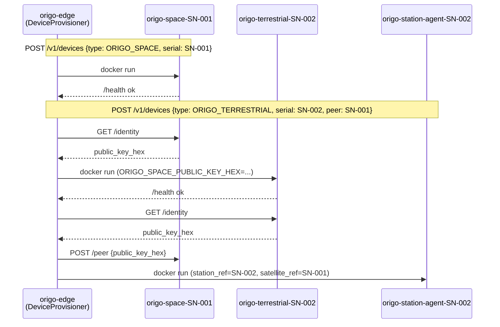

# Docker device loop (local dev / demo)

Registering a device through origo-edge/origo-platform starts a real container for
it, and a real ML-KEM-1024 + ML-DSA-87 handshake happens between two containers over
a real Docker network. RF and StellarStation stay mocked — no antenna, no orbit
geometry, no Infostellar API call anywhere in this path — see
`origo_info_adapter.dockerlink` for exactly where that mock sits.

This is a local-dev/demo convenience layered on top of the real system, not a
production deployment model. `docs/Origo System Design.md` §1 is still the source of
truth for trust boundaries; nothing here changes what origo-edge is allowed to touch.

## What gets created

| You register | Containers started | Notes |
|---|---|---|
| `ORIGO_SPACE` device | `origo-space-<serial>` | Runs `origo_space.server` (FastAPI wrapper around the real `OrigoSpaceAgent`). Publishes an ephemeral host port for its HTTP sidecar. |
| `ORIGO_TERRESTRIAL` device | `origo-terrestrial-<serial>`, `origo-station-agent-<serial>` | Terrestrial runs the real gRPC servicer + an identity-only HTTP sidecar. Station-agent runs the real, unmodified `PassExecutor`/`GrpcOrigoTerrestrial`. |

An `ORIGO_TERRESTRIAL` registration must set `peer_serial_number` to an
already-registered, already-running `ORIGO_SPACE` device's serial number — Origo
Space always comes first. This mirrors §2's "no live channel to negotiate a peer key
after the fact": whichever side is created second is the side that can fetch the
first side's public key over HTTP; the provisioner then pushes that side's key back
to the first, automating the "someone copies it over by hand" ceremony from §9.

## Provisioning ceremony, automated



## Running it

```bash
# once
mkdir -p vendor/wolfssl/lib vendor/wolfssl/include
cp -a /usr/local/lib/libwolfssl.so* vendor/wolfssl/lib/
cp -r /usr/local/include/wolfssl    vendor/wolfssl/include/wolfssl
make images

# turn it on
echo "ORIGO_DEVICE_PROVISIONING_ENABLED=true" >> origo-edge/.env
cd origo-edge && uv run alembic upgrade head && cd ..
make dev-edge   # unchanged — still runs on the host, now also holds the Docker socket

# register a pair
curl -X POST localhost:8000/v1/devices -H 'content-type: application/json' \
  -d '{"name":"Aster-1","type":"ORIGO_SPACE","serial_number":"SN-001"}'
curl -X POST localhost:8000/v1/devices -H 'content-type: application/json' \
  -d '{"name":"GS-North","type":"ORIGO_TERRESTRIAL","serial_number":"SN-002","peer_serial_number":"SN-001"}'
docker ps   # origo-space-sn-001, origo-terrestrial-sn-002, origo-station-agent-sn-002

# drive a real handshake between them
curl -X POST localhost:8000/v1/jobs -H 'content-type: application/json' \
  -d '{"type":"KEY_EXCHANGE","satellite_device_id":"<SN-001 device id>","ground_device_id":"<SN-002 device id>"}'
# within one ORIGO_STATION_poll_interval_sec (default 60s):
docker logs -f origo-station-agent-sn-002   # "kex.ct_uplinked"
docker logs -f origo-space-sn-001           # nothing printed on success today — see Open items
```

## Open items

- **DATA_DELIVERY / CONFIG_PUSH**: `DockerLinkAdapter` only implements the
  KEY_EXCHANGE hop (single ek frame, single ct uplink). `InMemoryAdapter` remains the
  adapter for exercising the other job types in tests.
- **mTLS**: `origo-station-agent`'s container ships a self-signed placeholder
  cert/key so `SyncClient` can construct at all (see its Dockerfile) — this is
  exactly the dev-token/`ORIGO_AUTH_DISABLED` path from design §9's open items, not a
  new gap this introduces.
- **Uncaught adapter errors**: `PassExecutor.run()` doesn't currently wrap
  `link.send_commands()` in a try/except the way it does the Origo Terrestrial calls
  — a failed uplink (`AdapterUnavailable` from `DockerLinkAdapter`) will propagate out
  of the station-agent poll loop today. Pre-existing gap, surfaced by having a real
  adapter that can now actually fail this way.
