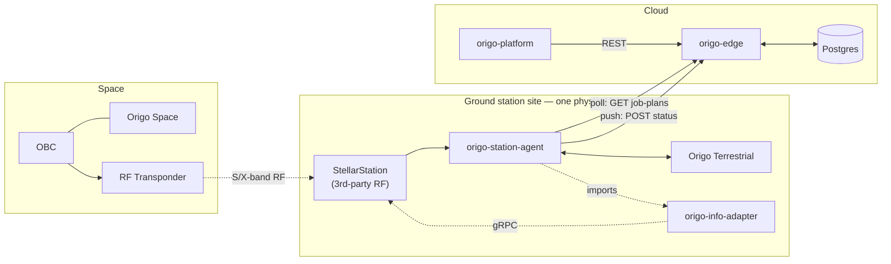

# Origo — System Design

## 0. Principle

Cryptographic custody and real-time execution live inside a trust boundary —
**Origo Space** (satellite) and **Origo Terrestrial** (ground). Orchestration,
scheduling, fleet visibility live in **origo-edge**. A full compromise of
origo-edge should yield operational visibility and disruption capability at worst —
never plaintext key material, never forgery capability.

## 1. Actors and trust boundaries

| Component | Segment | Trust boundary | Repo / artifact |
|---|---|---|---|
| OBC | Space | Outside| Existing spacecraft flight computer |
| **Origo Space** | Space | **Product boundary** | firmware |
| RF Transponder | Space | Outside | existing spacecraft hardware |
| StellarStation (3rd-party RF ground network) | Ground | Outside — untrusted relay | reached via `origo-info-adapter` |
| **Origo Terrestrial** | Ground | **Product boundary** | firmware |
| `origo-station-agent` | Ground | Trusted orchestrator | this repo |
| `origo-edge` | Cloud | User Facing Backend| this repo |
| `origo-platform` | Cloud | User Facing Frontend | this repo |

If a feature would require `origo-edge` to hold or compute with a private or session
key, that's a signal it belongs in Origo Space/Terrestrial firmware instead, exposed to
`origo-edge` as a command/config — never as a data flow. No exceptions have been found
for this yet.

## 2. Two standing facts about connectivity — read before touching any cross-process call

These aren't specific to one flow; they constrain every design decision below them.

**There is no live channel between origo-edge and Origo Space, in either direction.**
The satellite is reachable only by RF, through whichever ground station has a contact
window. Consequence: Origo Space cannot wait for a live "do this now" command — it
stores a job (pushed whenever there's next a contact opportunity) and acts on it
**autonomously** once the job's trigger condition is met during an actual pass. See
§4.

**There is no live channel between origo-edge and origo-station-agent either**, for a
related but distinct reason: a ground station can lose connectivity at any moment, and
maintaining live per-station connections doesn't buy enough to be worth the fragility.
Consequence: `origo-station-agent`'s Sync Client **polls** origo-edge
(`GET /v1/edge/stations/{ref}/job-plans`, default every 60s) rather than origo-edge
pushing to it. A request submitted through `origo-platform` lands in Postgres
immediately; it reaches the ground station on the *next poll cycle*, not instantly.
This is a real, user-visible latency, not an implementation detail to abstract away —
document it wherever "how fast does a request reach the satellite" comes up.

## 3. Deployment topology

`origo-info-adapter` is a library, not a service — it runs *inside* the
`origo-station-agent` process. `origo-station-agent`, `origo-info-adapter`, and Origo
Terrestrial share one physical enclosure at each ground station.

## 4. ML-KEM protocol flow

1. **origo-edge → (poll) → origo-station-agent**: a signed rekey job, picked up on
   the agent's own schedule.
2. **origo-station-agent → (local link) → Origo Terrestrial → OBC → Origo Space**: the
   job is delivered and stored. Origo Space triggers KeyGen the next time the condition is met during an actual pass.
3. **Origo Space**: QRNG → `KeyGen()` → (`ek`, `dk`). Signs `ek` (+ nonce, device id)
   with its ML-DSA identity key.
4. **Origo Space → OBC → RF Transponder → (S-band downlink) → StellarStation →
   `origo-info-adapter` → `origo-station-agent` → Origo Terrestrial**: `ek` + signature.
5. **Origo Terrestrial**: verifies the signature, checks nonce freshness,
   `Encapsulate(ek)` → (`K`, `ct`), signs `ct`.
6. **Origo Terrestrial → origo-station-agent → `origo-info-adapter` → StellarStation →
   (S-band uplink) → OBC → Origo Space**: `ct` + signature.
7. **Origo Space**: verifies, `Decapsulate(dk, ct)` → `K`, derives traffic keys via
   HKDF, stores wrapped, zeroizes transient state.
8. **Origo Space → ... → Origo Terrestrial** (status) and **Origo Terrestrial →
   origo-station-agent** (local, status): key id, timestamp, health — never the key
   itself. **origo-station-agent → (push) → origo-edge**: synced once the pass ends,
   not live.
9. **origo-edge**: `Key.state` → `ACTIVE`, `Job.state` → `ACTIVE`. Updates if the next rekey trigger changed.

**Why authentication is mandatory, not optional:** a bare KEM exchange only guarantees
confidentiality if `ek` is genuinely from Origo Space — an unauthenticated exchange is
trivially MITM'd by anything upstream of StellarStation's relay. `ek`/`ct` are signed
with ML-DSA identity keys established at provisioning; ongoing AEAD traffic is
authenticated by its own tag once the handshake completes, so the expensive signature
is paid once per rekey, not per packet.

**Sizes** (why S-band is comfortably sufficient for the handshake): ML-KEM-1024 —
`ek` 1568 B, `ct` 1568 B, shared secret 32 B. Default parameter set: ML-KEM-1024 —
satellites run for years, and the marginal bandwidth cost over ML-KEM-768 is
irrelevant at these sizes.

## 5. Data plane (X-band)

Bulk telemetry: AEAD (AES-256-GCM) under the session key from §4, per-message sequence
numbers for anti-replay. Origo Space encrypts before Data-Out; Origo Terrestrial
decrypts on arrival. Maps onto CCSDS 355.0-B (Space Data Link Security) with the Key ID
as the SPI. The decrypted result reaches `origo-edge` via the same push-status path as
key-exchange outcomes (§2), and from there is queryable — and downloadable — through
`origo-platform`.

## 6. API surfaces — three, deliberately different

| Link | Style | Auth | Why |
|---|---|---|---|
| `origo-platform` ↔ `origo-edge` | REST/JSON | OIDC (dev: disabled) | human-facing, low frequency, wants debuggability and a free generated TS client |
| `origo-station-agent` ↔ `origo-edge` | REST/JSON | device token (design: mTLS) | still low-frequency polling; same tooling payoff as above |
| `origo-station-agent` ↔ Origo Terrestrial | gRPC, Unix domain socket | app-layer signing (transport has no TLS — same host) | live, pass-time-critical: needs per-call deadlines and a schema-checked binary contract |
| `origo-info-adapter` ↔ StellarStation | gRPC, TLS + signed JWT | Google self-signed JWT | Infostellar's own API surface |

The two gRPC links share tooling and an error-translation idiom deliberately (protoc,
`grpc.aio`, status-code → typed-exception mapping) — the codebase reasons about one RPC
paradigm for the live paths, not two.

**On the Unix-socket choice specifically:** origo-station-agent and Origo Terrestrial
are confirmed to share physical hardware, so `grpc.aio.insecure_channel` over
`unix:///var/run/origo/origo-terrestrial.sock` replaced what was originally a TCP+TLS
link. "Insecure" here means "no TLS transport," not "no protection" — a Unix socket's
protection is the filesystem permission on the socket file; layering TLS on a link that
never leaves the machine buys certificate rotation overhead and nothing else. If Origo
Terrestrial ever moves to a physically separate board within the same enclosure, this
reverts to `secure_channel` — a one-line change, because `OrigoTerrestrial` is a
`Protocol` (`origo/ports.py`), not something `pass_executor.py` calls directly.

## 7. Ground-station host hardware (station-agent + info-adapter)

Both are I/O-bound: socket waits, KB-scale protobuf/JSON (de)serialization, logging.

- **CPU:** dual/quad-core ARM Cortex-A53/A72-class, ~1–1.5 GHz+ — comfortable headroom.
- **RAM:** 2 GB floor, 4 GB for years of headroom.
- **Storage:** 16–32 GB — OS, deps, and a real local telemetry/log retention window (the box keeps running on last-known state through an origo-edge outage, per §2).
- **Network:** wired Gigabit Ethernet to origo-edge and StellarStation; bandwidth scales with mission payload volume, not control-plane traffic.
- **OS:** real embedded Linux, glibc-based (grpcio's C extensions have more friction on musl/Alpine) — a full POSIX userspace, unlike Origo Terrestrial itself.
- **Environment:** industrial temperature range, conformal coating — a ground-station shelter isn't server-room controlled.

If Origo Terrestrial lands on a Zynq-7000-class SoC, its PS side (dual Cortex-A9,
embedded Linux) could host station-agent + info-adapter directly on the same chip —
worth revisiting once that hardware decision is made.

## 8. wolfCrypt / Origo Terrestrial implementation strategies (preview)

Full treatment is the next topic; the three live options, for continuity:

- **A — bare-metal, no RTOS.** wolfCrypt linked into one firmware image, hand-rolled
  interface state machine. Smallest attack surface and footprint; hardest to extend.
- **B — RTOS-hosted (FreeRTOS).** A dedicated Crypto Task owns every wolfCrypt call and
  all key material; MPU-backed task isolation makes "nothing but the crypto core
  touches keys" hardware-enforced, not just convention.
- **C — dedicated secure core (wolfHSM pattern).** If the SoC has a genuine
  hardware-separated secure core, wolfHSM's client-server split puts crypto execution
  and key custody there specifically — strongest isolation, closest match to the
  system's overall trust-boundary philosophy applied recursively at the chip level.
  VORAGO Technologies' rad-hard VA5 (dual-core) is the concrete lead here.

Recommendation stands: target C, fall back to B, treat A as a coding discipline to
apply inside whichever of B/C is chosen rather than a competing option.

## 9. Open items

- Origo Space and Origo Terrestrial firmware — not started; next topic.
- `origo-edge`'s `/v1/edge/*` auth is a shared dev token; production needs the mTLS
  device-certificate path the design has always called for.
- JobPlan/config signing is currently unsigned (`signature: ""`) — KMS-backed signing
  (§8.3 of the original spec) is unimplemented.
- Decrypted data-delivery results live in `Job.parameters` as an interim measure — a
  dedicated results table or object-store reference is the real answer past
  KB-to-low-MB payload sizes.
- `Pass`, `Telemetry` (health, not data-delivery results), `Alert`, and
  `AuditEvent` are still `origo-edge`'s hardcoded fixture responses — `Device`/`Key`/
  `Job` are the only fully DB-backed entities so far. Same pattern, not yet repeated.